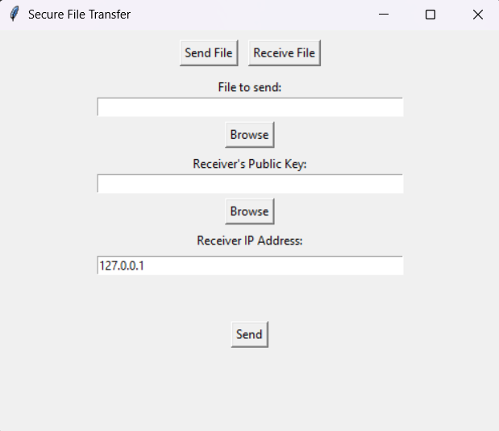
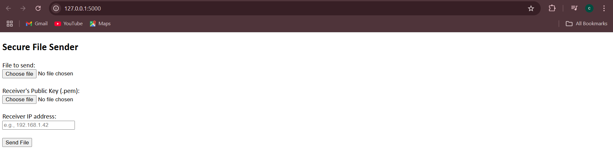
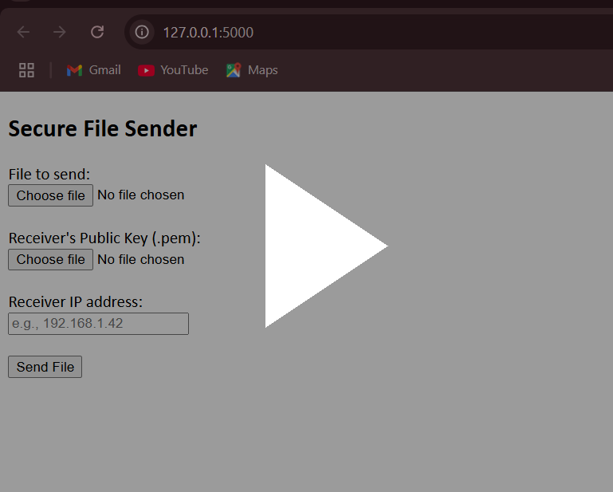

# 🔐 Secure File Transfer System

A full-featured encrypted file transfer system built in Python, supporting both GUI and Web interfaces. Designed to securely send any file type (text, image, video, PDF, etc.) over a local network, with AES encryption, RSA key exchange, and SHA-256 integrity verification.

---

## 💻 Interfaces Available

### 1. 📦 GUI Version (`gui_version/`)
- Desktop-based application using **Tkinter**
- Clean interface for sending and receiving files securely
- Select files directly from your system
- File encryption/decryption with AES-256 + RSA
- Preserves original filename and verifies integrity via SHA-256

### 2. 🌐 Web UI Version (`web_version/`)
- Built using **Flask**
- Upload file + receiver’s public key via browser
- View transfer status and logs in real-time
- Works from any device on the same network (mobile, tablet, etc.)
- Professional and extensible (e.g., drag & drop, authentication)

---

## 🔐 Cryptography Overview

- **AES-256 (CBC Mode)**: Encrypts the actual file content
- **RSA (2048-bit)**: Encrypts the AES key during transfer
- **SHA-256 Hashing**: Ensures file integrity after decryption

---
## 🔧 Setup Instructions

1.Clone the repository:

git clone https://github.com/chaithra1808/secure-file-transfer.git

cd secure-file-transfer

2.Install dependencies:

pip install flask pycryptodome

3.(Optional) Generate new RSA keys:

python tools/rsa_keygen.py

🚀 How to Run

GUI Version:

cd gui_version

python gui_transfer.py

Web Version:

1.Start the receiver:

cd web_version

python receiver_web.py

2.Start the sender in a new terminal:

cd web_version

python sender_web.py

3.Visit the interfaces:

Sender: http://localhost:5000

Receiver: http://localhost:5001

## 🎥 Demo & Screenshots

### GUI Version

*The desktop app interface to securely send and receive files.*

### Web UI Version

(./screenshots/web_screenshot-2.png)

*Web interface for sending files via browser.*

### Demo Video

*Click the image above to watch a short demo of the system in action!*

✅ Features
AES-256 encryption with randomly generated key per transfer

RSA public key encryption for secure key exchange

File hash verification with SHA-256

Auto filename preservation

Supports all file types (images, videos, PDFs, etc.)

Clean web and GUI interfaces

🧠 Project Journey
This project evolved from a command-line interface (CLI) prototype into full GUI and Web UI applications. It reflects practical skills in cryptography, secure communications, Python GUI/web development, and full-stack thinking.

